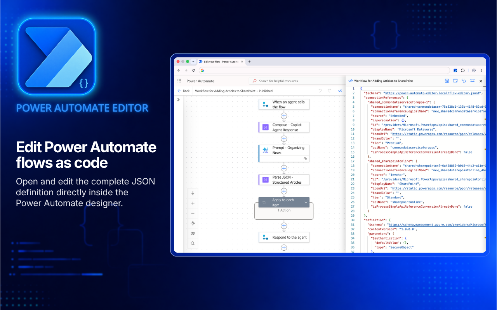
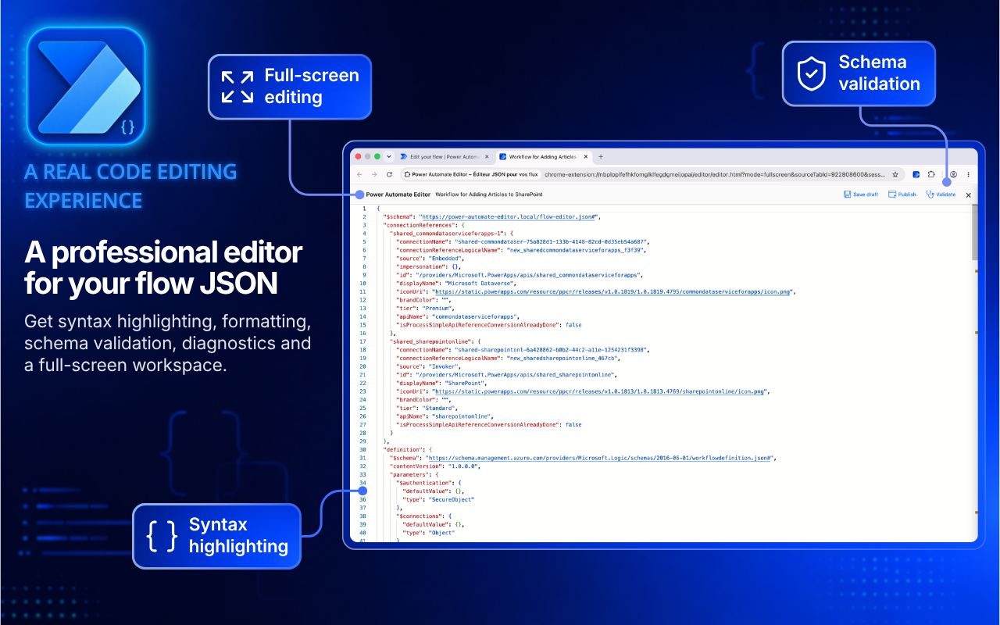
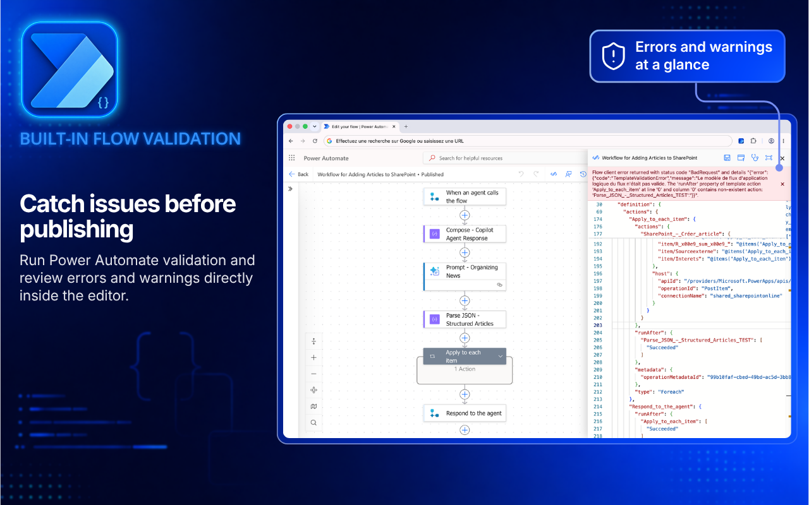
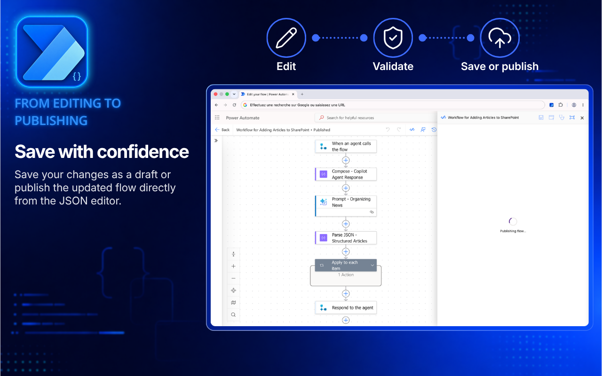

  

# Power Automate Editor

**Edit your Power Automate flows like code.**

Inspect, edit, validate and publish Microsoft Power Automate flow JSON directly from the designer, with a code editor powered by Monaco.

[**Install from the Chrome Web Store**](https://chromewebstore.google.com/detail/mfdmecomnlocbddniidddpkkomhmpkgl?utm_source=github) · [Report a bug](https://github.com/MaximeGrn/power-automate-editor/issues/new?template=bug_report.md) · [Suggest a feature](https://github.com/MaximeGrn/power-automate-editor/issues/new?template=feature_request.md)

## Why use it?

When the visual designer gets in the way, work directly with your flow's JSON without the export, unzip, edit and reimport cycle. Inspect actions, expressions and connection references together, make changes in one place, then validate and save them from the editor.

Open the editor alongside the designer to keep the visual flow in view. Resize the panel as you work, or move the current draft into a separate tab for more space when editing a large definition.

## Get started

1. [Install the extension from the Chrome Web Store](https://chromewebstore.google.com/detail/mfdmecomnlocbddniidddpkkomhmpkgl?utm_source=github).
2. Open a cloud flow in the [Power Automate designer](https://make.powerautomate.com/) and wait for it to finish loading.
3. Click **Editor** in the designer toolbar (tooltip: **Edit the flow as JSON**).
4. Edit the JSON, then click **Validate** to review errors and warnings.
5. Choose **Save draft** or **Publish** when your changes are ready.

You need a signed-in Microsoft account with permission to edit the flow. The extension uses your existing Power Automate session and does not bypass Microsoft permissions or licensing.

Keep a backup before making substantial changes. Validation helps detect issues, but test the flow after publishing to confirm its behavior.

## Features

### A code editor for your flow JSON

Monaco provides syntax highlighting, line numbers, search and replace, and JSON formatting, making long flow definitions easier to navigate. Formatting on paste helps keep edits readable, while JSON schema diagnostics highlight structural problems as you type.

Use the full-screen button to open the editor in a separate browser tab with your current edits. The editor shows an **Unsaved changes** indicator, and **Cmd+S** on macOS or **Ctrl+S** on Windows/Linux saves a draft.

### Validate with Power Automate

Click **Validate** to check the edited definition using Power Automate's validation services. Results appear inside the editor, grouped into errors and warnings, with the affected operation and its message so you can find what needs attention.

This complements the JSON schema diagnostics: valid JSON can still contain a flow configuration that Power Automate rejects. When Microsoft returns fix instructions, you can copy them from the results panel. After making corrections, run validation again before publishing.

### Save a draft or publish your changes

**Save draft** saves your edited definition without publishing it, so you can keep working before making the update live. **Publish** saves the draft and publishes the updated flow through Microsoft services, directly from the JSON editor.

Both actions use your existing Microsoft session and require permission to edit the flow. Availability depends on the flow and the Microsoft context loaded by the designer. If the editor asks you to save from the designer first, do so, then retry. Success and error messages appear in the editor; diagnostic details can be copied when troubleshooting an error.

### Bring your flow to your preferred AI assistant

Copy the JSON into ChatGPT, Claude, Gemini, Microsoft Copilot or another assistant to explain a flow, investigate an error, draft documentation or suggest changes across several actions. For example, ask an assistant to explain the conditions in a flow or identify where an expression should be updated.

Review the suggestions, apply the relevant changes in the editor, then validate and test the flow. You choose what to copy and where to share it; the extension does not automatically send your flow to an AI service and requires no AI API key. Remove sensitive information before sharing.

## Privacy and permissions

Flow editing uses requests from your browser to Microsoft services; it does not require an external editing server. Monaco and JSON schemas are bundled with the extension.

The extension uses browser storage for preferences and session state, tab access for the editor workspace, and access to Power Automate, Power Platform and Dataverse domains to load, validate and save flows using your existing session.

On uninstall, the extension opens a Tally feedback form with technical context in its URL: operating system, extension version, interface language, extension language and installation date. This is separate from flow editing.

If you copy JSON into an AI assistant or attach it to an issue, review it first and remove credentials, personal data and confidential business information.

## FAQ

**Is this repository the extension source code?**

This is the public documentation and feedback repository. The extension source code is not published here. Install the packaged extension from the Chrome Web Store.

**Does it work with Power Automate Desktop?**

This extension is for cloud flows in the browser-based Power Automate designer.

**Where is the editor button?**

Check that the extension is enabled in its popup, refresh Power Automate and wait for the flow designer to load. If it still does not appear, report a bug with your browser version and the steps to reproduce it.

**Can I use it with AI?**

Yes: copy the JSON into your preferred assistant, review its suggestions, then apply and validate the changes in the editor. No AI account or API key is needed by the extension itself.

**What about Microsoft Edge?**

The installation link here is for Chrome. An Edge Add-ons listing will be linked here when available.

## Feedback and support

Found a problem? [Report a bug](https://github.com/MaximeGrn/power-automate-editor/issues/new?template=bug_report.md) with reproduction steps, expected behavior and your browser and extension versions. Screenshots are welcome; remove sensitive details first.

Have an idea? [Suggest a feature](https://github.com/MaximeGrn/power-automate-editor/issues/new?template=feature_request.md) and describe the problem it would solve.

If the extension helps you, a [Chrome Web Store review](https://chromewebstore.google.com/detail/mfdmecomnlocbddniidddpkkomhmpkgl?utm_source=github) or a GitHub star helps others discover it.

---

Power Automate Editor is an independent project and is not affiliated with or endorsed by Microsoft. Microsoft Power Automate and other product names belong to their respective owners.
